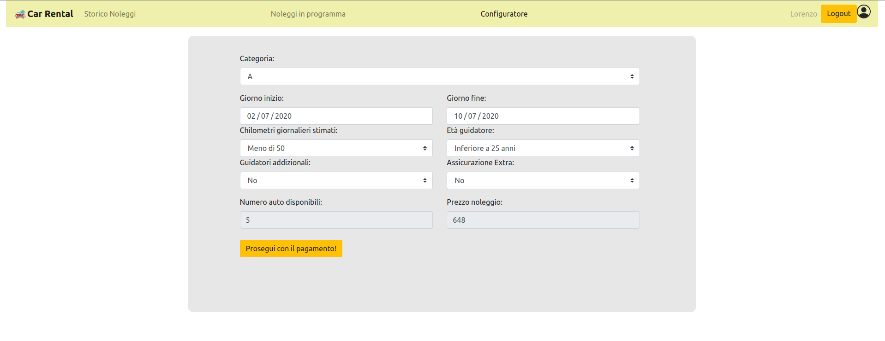

# Installazione 
  '''
  git clone https://github.com/LorenzoCeccarelli/CarRental-React.git
  '''
# Descrizione

## React client application routes

- Route `/`: pagina iniziale, fa una redirect a "/login"
- Route `/login`: pagina per la gestione del login, fa una redirect a "/configuratore" se l'utente è già autenticato
- Route `/catalogo` : pagina dove è possibile visualizzare e filtrare (per categoria e marca) le auto, 
                      fa una redirect a "/configuratore" se l'utente è autenticato
- Route `/configuratore` : pagina che permette, se l'utente è autenticato, di inserire i parametri del noleggio,
                           visuallizzare prezzo e auto disponibili per quella configurazione ed eventualmente acquistare il noleggio scelto
- Route `/storicoNoleggi` : pagina che permette, se l'utente è autenticato, di consultare lo storico dei noleggi effettuati
- Route `/prossimiNoleggi`: pagina che permette, se l'utente è autenticato, di consultare i noleggi futuri ed eventualmente cancellarli.
                            Inoltre visualizza anche i noleggi correnti, senza dare la possibilità di cancellarli
   
## REST API server

- POST `/api/login`   
  - Request body content: email e password dell'utente 
  - Response body content: Se email e password sono corrette cookie e nome dell'utente autenticato, errore altrimenti
- POST `/api/logout` 
  - Request body content: none 
  - Response body content: none 
  - Cancella il cookie dal server
- GET `/api/allCars`
  - request parameters: none
  - response body content: lista di tutte le auto presenti nel database, oppure errore
- GET `/api/categories`
  - request parameters: none
  - response body content: lista di tutte le categorie (distinte) delle auto presenti nel database 
- GET `/api/brands`
  - request parameters: none
  - response body content: lista di tutte le marche (distinte) delle auto presenti nel database 
--- ENDPOINTS PROTETTI DA AUTENTICAZIONE ---
- GET `/api/user`
  - request parameters: none
  - response body content: se l'utente è autenticato nome e cognome, altrimenti errore
- GET `/api/cars/?filters` (filters è una stringa del tipo categoria=x&giornoInizio=y&...)
  - request parameters: categoria, data di inizio, data di fine, guidatori addizionali,Km stimati, età del guidatore e assicurazione extra
  - response body content: numero di auto disponibili e prezzo della configurazione richiesta, oppure errore
- POST `/api/pay`
  - request body content: codice della carta, nome intestatario, codice CVV e prezzo
  - response body content: ok oppure errore
- GET `/api/noleggi/futuri` 
  - request parameters: email utente
  - response body content: lista dei noleggi futuri (e correnti) dell'utente
- GET `/api/noleggi/storico` 
  - request parameters: email utente
  - response body content: lista dello storico dell'utente
- POST `/api/noleggio`
  - request body content: categoria,data di inizio, data di fine,guidatori addizionali,Km stimati,età del guidatore e assicurazione extra
  - response body content: ok oppure errore
- DELETE `api/noleggio/id`
  - request parameters: id del noleggio
  - request body content: email dell'utente
  - response body content: ok oppure errore

## Server database

- Table `CARS` - contiene Cid, Categoria, Marca e Modello (contiene le info riguardante ciascuna auto)
- Table `NOLEGGI` - contiene RId, Cid, Email, GiornoInizio, GiornoFine, EtaGuidatore, GuidatoriAddizionali, KmStimati, AssicurazioneExtra e Prezzo (contiene le info riguardanti ciascun noleggio)
- Table `USERS` - contiene Email, Nome, Cognome, Hash (contiene le info di ciascun utente)

## Main React Components

- `App` (in `/client/src/App.js`): contiene lo switch per tutte le routes
- `Catalogo` (in `/client/src/components/Catalogo.js`): gestisce la visualizzazione e i filtri (per categoria e marca) della lista di auto
- `Configuratore` (in `/client/src/components/Configuratore.js`): gestisce il configuratore interattivo, visualizza il numero di auto disponibili
  e il prezzo di ciascuna configurazione scelta dall'utente. Inoltre permette la conferma e il pagamento di un nuovo noleggio
- `FuturiNoleggi` (in `/client/src/components/FuturiNoleggi.js`): permette di visualizzare i noleggi futuri e correnti dell'utente ed eventualmente
  cancellarli (solo noleggi futuri)
- `StoricoNoleggi` (in `/client/src/components/StoricoNoleggi.js`): permette di visualizzare lo storico dei noleggi
- `Header` (in `/client/src/components/Header.js`): rappresenta la barra di navigazione in alto, 
  ha diversi comportamenti a seconda se l'utente è autenticato oppure no
- `Login` (in `/client/src/components/Login.js`): gestisce l'autenticazione dell'utente attraverso un form

NOTA: Ogni main component sopra citato contiene al suo interno altri componenti che implementano tutte le varie funzionalità richieste

## Screenshot

## Test users

* User1@email1.com, user1
* User2@email3.com, user2
* FrequentUser1@email1.com, Fuser1 (frequent customer)
* User3@email4.com, user3
* FrequentUser2@email2.com, Fuser2 (frequent customer)

## Note
- Durante l'esecuzione dell'applicazione potrebbero comparire warnings relativi alle librerie dei componenti (Modal e MultiSelect)
- Se nodemon server.js non funziona, provare ad eseguire sudo npm install -g nodemon e a rilanciare il comando
